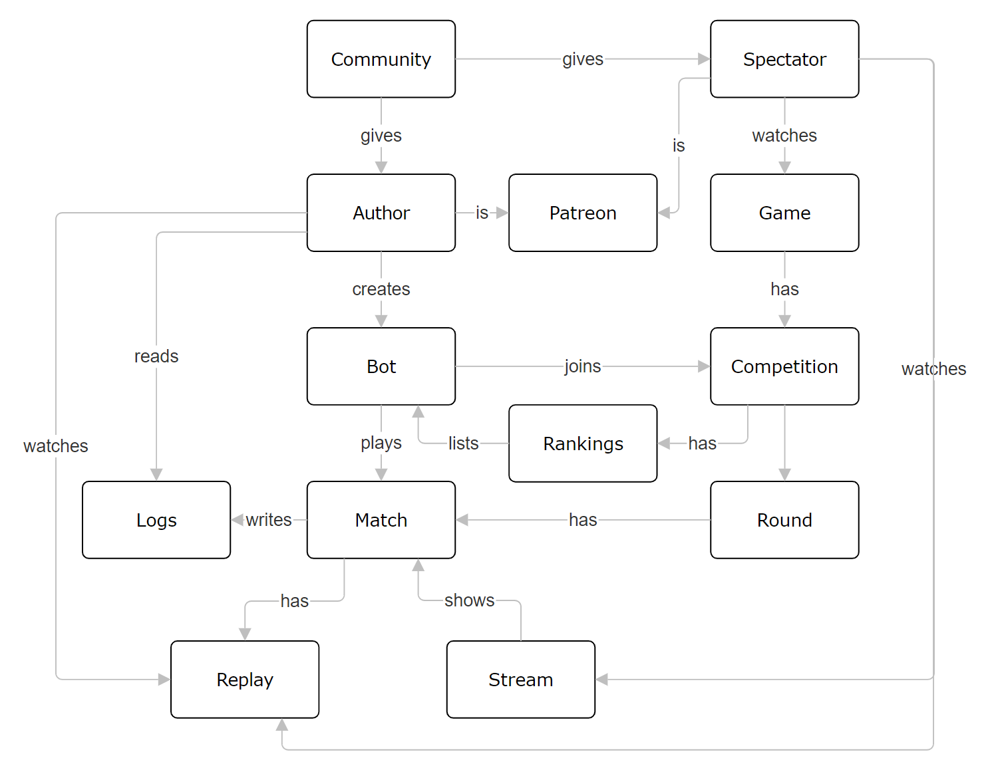
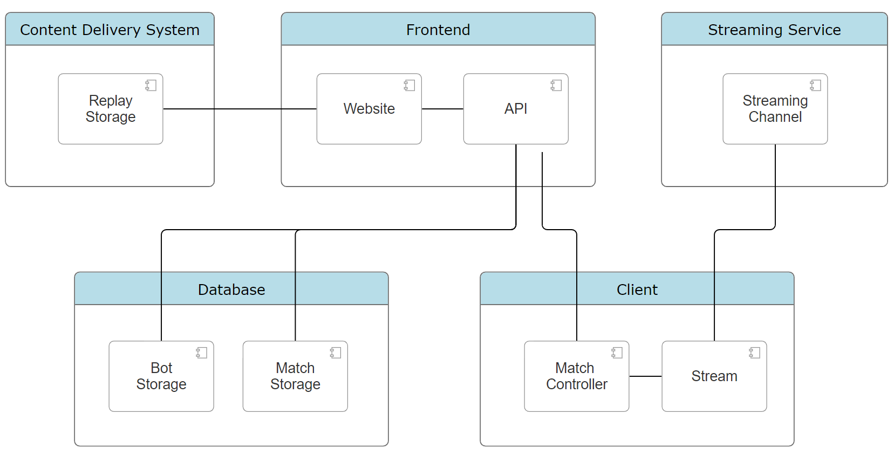

This is a description of the architecture of AI Arena.

AI Arena works with the following entities:
* **Bots** - Bots compete in the arena in various competitions. Each bot has a unique identifier, a name, biography, one code bundle (called *Bot Zip*), and one data bundle (called *Bot data*) to pass internal information along its matches.
* **Authors** - Bot authors create bots and enroll them in competitions.
* **Spectators** - Spectators are people who enjoy watching bots play games.
* **Patreons** - Patreons are bot authors and spectators who give financial support to AI Arena. AI Arena is free to watch and play, it is not pay-to-win, but patreons enjoy additional benefits like higher limits for match requests.
* **Games** - There are different games, like StarCraft II and Poker, the bots can play.
* **Competitions** - Competitions are organized by AI Arena for many bots to play one game. Each competition has rules, open and close dates, rounds, rankings and rounds. It has game-specific properties, like maps in StarCraft II.
* **Rankings** - The bots participating in a competition are ranked by their ELO rating within the competition and are split into devisions according to the rules of the competition. Competitions usually start with a single division and ELO of 1600 for all bots. Bots may join and leave a competition between any two rounds and joining bots start with ELO rating of 1600.
* **Rounds** - Competitions are played in rounds where each bot plays one match against each other bot in the same division of the rankings.
* **Matches** - A match is played by two bots. Matches are either started within a round of an active competition, or manually requested by a bot author or a spectator. Matches of a competition affect the ELO rating for the participating bots for this competition. Manually requested matches don't affect the ELO rating of the participating bots.
* **Logs** - Matches produce logs for both bots for the bot authors to inspect and improve their bot. The logs for a bot are accessible only to their bot author.
* **Replays** - Matches produce game replays. Replays are publicly accesible. They are watched by bot authors to improve their bots, and by spectators for fun.
* **Stream** - Replays of games like StarCraft II requires additional software to play, so AI Arena streams matches for easier viewing.
* **Communities** - Bot authors and spectators usually come to AI Arena from communities that are interested in bots playing games. AI Arena links back to the communities and feeds content like bot performance and competition results back to the communities.

# Systems

- Website - The website is the frontend to AI Arena. It contains a Web site for users and API endpoints for tools.
- Database - The database contains the records for bots, authors, games, competitions, rankings, rounds, and matches.
- Content delivery system - Stores and provides access to the replays and logs of matches.
- Match controller - Plays requested matches by running 2 bots on 1 game. The client fetches the input match information from the API of the website and feeds the output match information back to the API of the website.
- Streaming service - Streams match replays for users.
- Stream component - Converts a replay to the media format of the streaming service and feeds it.
- Wiki - Contains information about AI Arena, the games, competitions and their rules, instructions and guides for bot authors, etc.
- Patreon service - Used for handling donations from patreons.

# Technologies

* AgroCD - TODO: Verify if AgroCD controls the number of clients
* AWS - Used as cloud infrastructure for all self-hosted technologies.
* Docker - 
* GitHub - Stores the source code for AI Arena.
* Kubernetes - TODO: Verify if the website and the clients run in the same Kubernetes cluster
* Patreon - Used for the patreon service.
* PostgreSQL - Used for the database. Version 15. Managed service by AWS.
* Rancher - Controls the Kubernetes cluster
* Twitch - Used for the streaming service.
* Wiki
